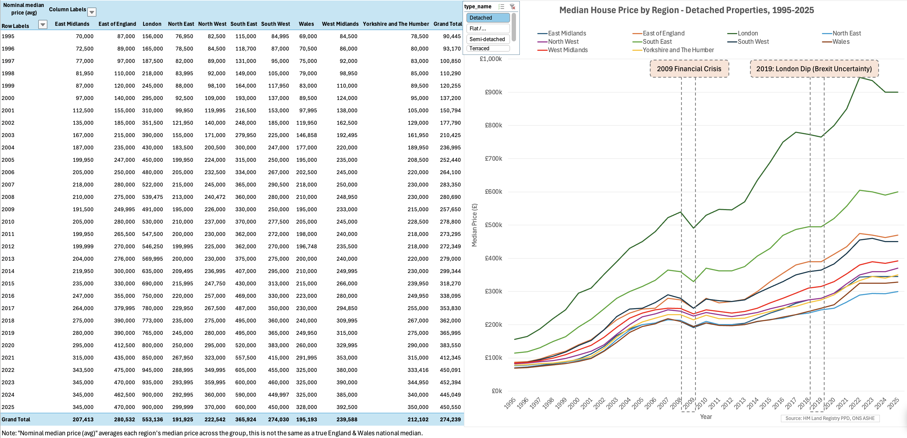
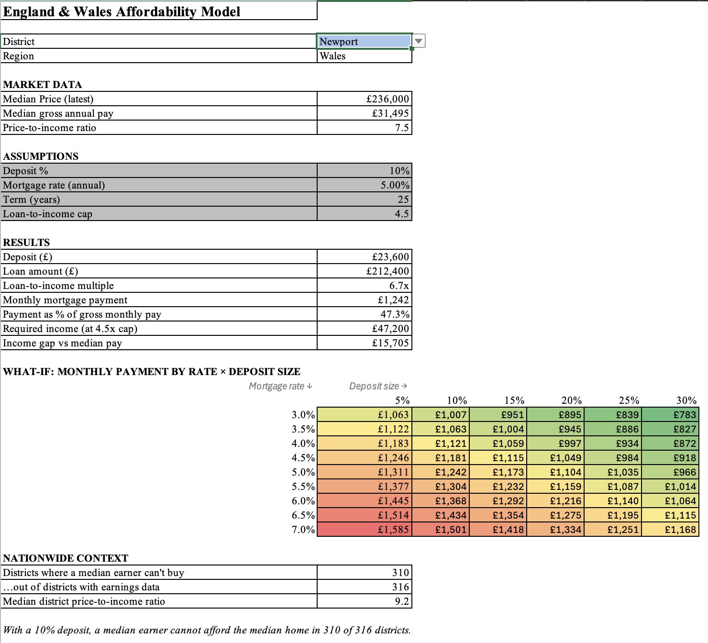
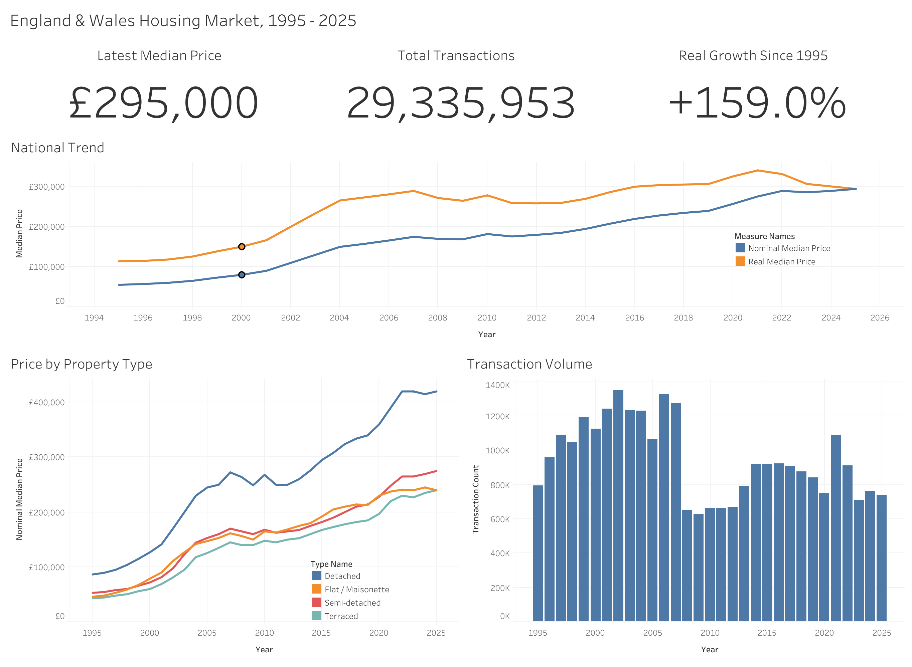
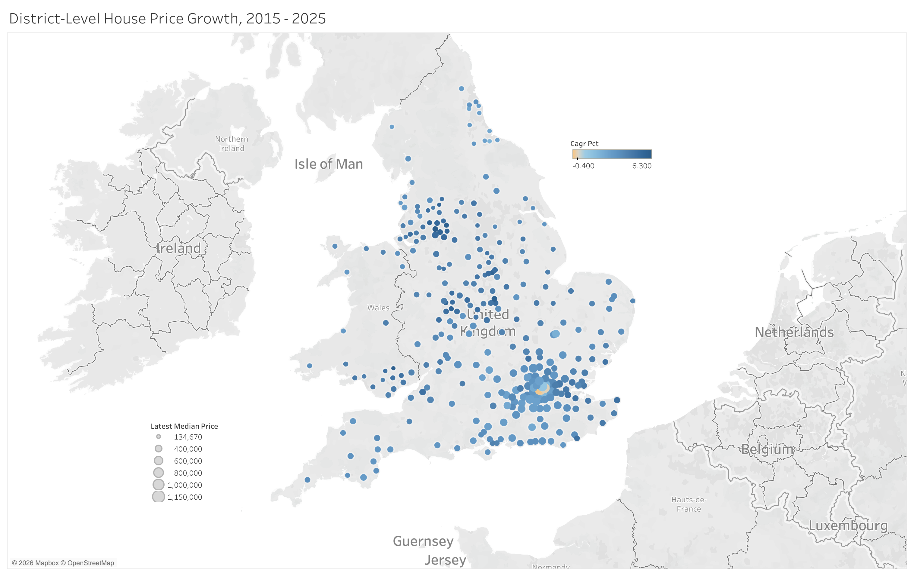

# England & Wales Housing Market Analysis (1995–present)

> **Scope note:** this project covers **England and Wales only**, not the whole UK. HM Land Registry Price Paid Data excludes Scotland (Registers of Scotland) and Northern Ireland (Land & Property Services). Verified empirically: the dataset contains no Scottish (EH/G) or Northern Irish (BT) postcodes.

An end-to-end analysis of ~29M residential property transactions, built to answer one stakeholder question:

> *"Across England & Wales, where and how has the housing market moved since 1995 and how has affordability shifted for an ordinary buyer?"*

The intended reader is non-technical, i.e. someone deciding where to look, what type of property to consider and whether they can afford it.

## Stack & architecture

Python (profiling + ETL) -> PostgreSQL (star schema warehouse) -> SQL (16 analytical queries) -> Tableau Public (interactive dashboard) -> Excel (affordability model with Power Query, pivots, PMT).

```
pp-complete.csv ─┐
                 -> Python: profile + clean -> COPY into Postgres (staging)
ONSPD ───────────┘                                      │
                                                        ▼
                                          Transform -> star schema
                                          (dim_date, dim_geography,
                                           dim_property_type, fact_sales)
                                                        │
                        ┌───────────────────────────────┼───────────────────────────┐
                        ▼                               ▼                           ▼
              16 analytical SQL queries      Pre-aggregated extract       Earnings + CPIH joins
                                                       │                            │
                                                       ▼                            ▼
                                              Tableau dashboard         Excel affordability model
```

The database does the heavy lifting, Tableau and Excel only ever see aggregates, never the raw 29M rows.

## Data sources

| Source | Role | In repo? |
|---|---|---|
| [HM Land Registry Price Paid Data](https://www.gov.uk/government/statistical-data-sets/price-paid-data-downloads) (`pp-complete.csv`, ~6 GB) | Every standard residential sale in E&W since 1995 | No - download separately |
| [ONS Postcode Directory (ONSPD)](https://geoportal.statistics.gov.uk/) | Postcode → local authority, region, lat/long | No - download separately |
| [ONS Local Authority Districts (April 2025) Names and Codes in the UK (V2)](https://geoportal.statistics.gov.uk/datasets/ons::local-authority-districts-april-2025-names-and-codes-in-the-uk-v2/about) (`LAD25_names_and_codes.csv`) | LAD code → human-readable name lookup (`dim_geography.lad_name`, backfilled by `scripts/04_backfill_lad_names.py`) | No - download separately |
| ONS ASHE median earnings by local authority | Affordability model (price-to-income) | No |
| ONS CPIH index | Deflating nominal prices to real terms | No |

Raw data is excluded via `.gitignore` (6.5 GB). Place downloads in `data/raw/` to reproduce.

Contains HM Land Registry data © Crown copyright and database right 2026. Licensed under the [Open Government Licence v3.0](https://www.nationalarchives.gov.uk/doc/open-government-licence/version/3/).

## Known limitations (stated up front, deliberately)

- **Nominal prices** Raw prices are not inflation-adjusted, over 30 years that overstates "growth" badly. The headline trend is also produced in real (CPIH-deflated) terms.
- **Mix/composition effect** A median of transacted prices reflects what sold, not pure price change, which is why the official UK HPI uses hedonic/repeat-sales methods. The repeat-sales query (#15) is a partial mitigation, not a replication.
- **Category A only** Analysis filters to standard sales (Category A, ~29.5M rows). Category B (repossessions, portfolio/company transfers, ~1.8M rows) is excluded and noted.
- **Coverage** Excludes gifts, transfers not for value, some right-to-buy, and commercial property. This is "standard residential sales registered with HMLR," not "all property".
- **Missing postcodes** 14,203 rows (0.05%) can't be geocoded: kept in national aggregates, excluded from maps.
- **New-build registration lag** HMLR registers a sale once it's lodged, an ordinary resale clears in 2 weeks–2 months, but a new-build sale needs a first registration of a brand-new title, which HMLR's currently published processing times put at up to 12 months. That shows up directly in query #3: new-build share of sales falls from 9.3% (2024) to 4.3% (2025) to 0.1% (2026), which is far too sharp to be a real housebuilding slowdown, and not just a partial-year artifact, since 2025 is a complete calendar year. Treat new-build figures from ~2024 onward as increasingly provisional.
- **District coverage: 317 of 318, and 316 for affordability** England & Wales has 318 local authority districts. The district-level price analysis covers 317 — the Isles of Scilly is excluded for insufficient transaction volume. The affordability model covers 316: the City of London additionally lacks ASHE earnings data (its resident population is too small to survey reliably).
- **Stamp duty deadline distortions** Governments announce stamp duty threshold changes ahead of time, so buyers rush to complete just before the deadline, then volumes dip right after. E.g. March 2016 (second-home surcharge) and March 2025 (nil-rate threshold cut) both show up as sharp single-month spikes in query #8's seasonality data. I will treat isolated month-to-month spikes/dips as policy-driven, not organic demand shifts.

## Key findings (1995–2025)

1. **Prices rose 5.4× nominally, but only 2.6× in real terms - and the real market peaked in 2021** The national median went from £55,000 to £295,000. Deflated by CPIH, that is a 2.6× rise, and the real median has fallen ~14% since its 2021 peak. Four consecutive years of real-terms decline are invisible in a nominal chart, which is why the analysis reports both.

2. **London pulled away from the rest of the country for three decades** London's median moved from 1.33× the national median in 1995 to 1.79× in 2025 (7.2× nominal growth) whereas the North East fell from 0.78× to 0.58× (4.0×). The gap between the strongest and weakest region roughly doubled.

   
   *The workbook's pivot tab: regional divergence for detached homes, with a property-type slicer and annotated market events.*

3. **The last decade reversed the winners** The five fastest-appreciating districts of 2015–2025 are Salford (6.3% CAGR), Blaenau Gwent (6.1%), Leicester, Oldham, Sandwell, they are all in the North, Midlands or Wales. The five slowest are all prime London: Kensington & Chelsea, Westminster and Hammersmith & Fulham posted *negative* nominal CAGRs. Prime London has flatlined for ten years while Salford's median nearly doubled.

4. **A median earner cannot buy the median home in 310 of 316 districts** The median district price-to-income ratio is 9.2 which is more than double the 4.5× loan-to-income cap lenders apply. Even with a 10% deposit, median pay falls short of the required income in 98% of districts. The exceptions are all in the North West, North East and the Welsh valleys (Burnley is the most affordable at 4.5). At the other extreme, Kensington & Chelsea sits at 24.6×. The Excel model in `excel/` makes this interactive: pick a district, see the gap.

   
   *The affordability tab for Newport: a median earner needs £47,200 to borrow the median home, against median pay of £31,495.*

5. **The cheap end grew fastest** Terraced homes appreciated 5.6× against 4.9× for detached. The price growth was strongest precisely in the segment where first-time buyers compete.

All figures are reproducible from the aggregates in `tableau/` and the `Merged` tab of the Excel workbook, the underlying queries are in `sql/`.

## Repository structure

```
├── notebooks/             # Data profiling (row counts, quality checks, filter decisions)
├── scripts/               # Python ETL (Phase 1)
├── sql/                   # Schema DDL + 16 analytical queries (Phase 2)
├── tableau/               # Dashboard workbook + aggregate extracts (Phase 3)
├── excel/                 # Affordability model (Phase 4)
└── data/
    ├── raw/               # Source files (gitignored)
    └── processed/         # Cleaned/aggregated outputs
```

## Status

| Phase | Work | Status |
|---|---|---|
| 0 | Profile data, decide filters (Cat A, price ≥ £10k, exclude partial 2026) | ✅ Done - see `notebooks/` |
| 1 | Clean + COPY-load into Postgres star schema, ONSPD geography merge | ✅ Done |
| 2 | 16 analytical SQL queries | ✅ Done - see `sql/` |
| 3 | Tableau Public dashboard | ✅ Done - [live dashboard](https://public.tableau.com/app/profile/pavlo.petrashko/viz/EnglandWalesHousingMarketAnalysis1995-2025/Overview) |
| 4 | Excel affordability model | ✅ Done - see `excel/` |
| 5 | Findings, screenshots, polish | ✅ Done |

**Live dashboard:** [England & Wales Housing Market Analysis (1995-2025) on Tableau Public](https://public.tableau.com/app/profile/pavlo.petrashko/viz/EnglandWalesHousingMarketAnalysis1995-2025/Overview) - Overview (national trend, price by property type, transaction volume) and District Map (2015-2025 CAGR by local authority) tabs.

[](https://public.tableau.com/app/profile/pavlo.petrashko/viz/EnglandWalesHousingMarketAnalysis1995-2025/Overview)
*Overview tab - the orange real (CPIH-deflated) line peaking in 2021 is finding #1. Click through for the interactive version.*

[](https://public.tableau.com/app/profile/pavlo.petrashko/viz/EnglandWalesHousingMarketAnalysis1995-2025/Overview)
*District Map tab - colour is 2015-2025 CAGR (brown = negative, dark blue = fastest), size is latest median price. Prime London: big and brown.*

---

*Pavlo Petrashko - [pavlo.petrashko@gmail.com](mailto:pavlo.petrashko@gmail.com)*
